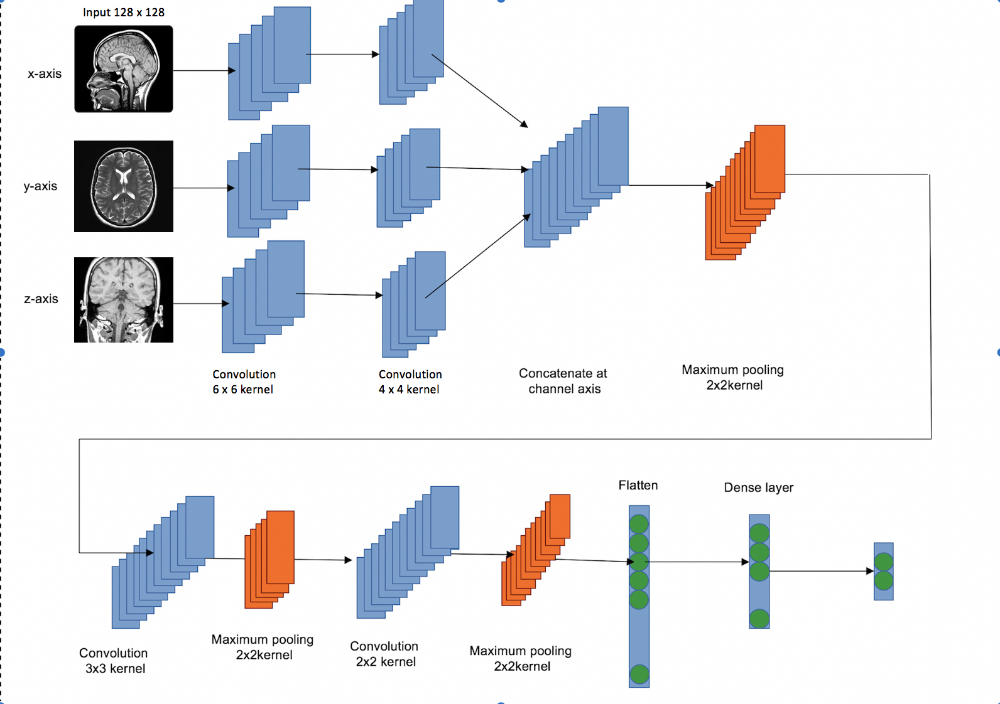

#Highlight
This is a training pipeline for the Computable Hyper Volume Phenotype project. We try to implement the slice 2D CNN on 3D, various shape MRI data. 

#Preprocessing
The pipeline support to different image preprocessing method.  
 - Zooming: Only resize the images to a fix size for the neural network.  
 - Registration: We apply the registration by the SimpleITK MRI toolbox. Registration is the process that transforms different sets of images into one coordinate system. By utilizing so, we could overcome center inconsistency.

Please check Makefile for more information.

#Network Architecture

Basically we are going to slicing our MRI data (3D) along with x-axis, y-axis, and z-axis. Using slicing to subsample the 3D data back to 2D. So that we don't need a huge computational power to run the 3D CNN model. 

#Results
<table>
    <thead>
        <tr>
            <th>ROC Score</th>
            <th>Zooming</th>
            <th>Registration</th>
        </tr>
    </thead>
    <tbody>
        <tr>
            <td rowspan=3>10 slices</td>
            <td bgcolor=orange>61</td>
            <td bgcolor=orange>59</td>
        </tr>
        <tr>
            <td>56</td> <td>59</td>
        </tr>
        <tr>
            <td>59</td> <td>57</td>
        </tr>
        <tr>
            <td rowspan=3>20 slices</td>
            <td>61.8</td> <td>61</td>
        </tr>
        <tr>
            <td bgcolor=orange>63.8</td> <td bgcolor=orange>61.8</td>
        </tr>
        <tr>
            <td>60.9</td> <td>59.4</td>
        </tr>
        <tr>
            <td rowspan=3>30 slices</td>
            <td>59</td> <td bgcolor=orange>63</td>
        </tr>
        <tr>
            <td>62.8</td> <td>61.2</td>
        </tr>
        <tr>
            <td bgcolor=orange>66.5</td> <td>61</td>
        </tr>
    </tbody>
    <caption>Table 1</caption>
</table>

Table 1 above demonstrated that the number of slices we 
the cut has positive effects on the model performance. The more slices we cut, the better the performance of our model. This is quite reasonable because the more slices we cut, the more information we give to our model. As a result, the model could utilize more features and thus make better decisions.

Base on the result above, we test different dropout rate for 30 slices training. This time, we using accuracy as our evaluation method.

<table>
    <thead>
        <tr>
            <th></th>
            <th colspan=2>Registration</th>
            <th colspan=2>Zooming</th>
        </tr>
        <tr>
            <th>Dropout</th>
            <th>roc</th>
            <th>acc</th>
            <th>roc</th>
            <th>acc</th>
        </tr>
    </thead>
    <tbody>
        <tr>
            <td rowspan=3>0</td>
            <td >58.9</td>
            <td bgcolor=orange>57.2</td>
            <td >64</td>
            <td bgcolor=orange>60.9</td>
        </tr>
        <tr>
            <td >58.4</td>
            <td>54.2</td>
            <td >63</td>
            <td>60.9</td>
        </tr>
        <tr>
            <td >59.3</td>
            <td>57</td>
            <td >62.9</td>
            <td>60</td>
        </tr>
        <tr>
            <td rowspan=3>0.1</td>
            <td >57.9</td>
            <td >56.7</td>
            <td >63.5</td>
            <td bgcolor=orange>61.5</td>
        </tr>
        <tr>
            <td >60.8</td>
            <td >58.2</td>
            <td >63.5</td>
            <td >61.5</td>
        </tr>
        <tr>
            <td >60.5</td>
            <td bgcolor=orange>59.1</td>
            <td >64.4</td>
            <td >61.2</td>
        </tr>
        <tr>
            <td rowspan=3>0.3</td>
            <td >60.8</td>
            <td >58.5</td>
            <td >63.1</td>
            <td >58.8</td>
        </tr>
        <tr>
            <td >60.4</td>
            <td >57.9</td>
            <td >61.9</td>
            <td >60</td>
        </tr>
        <tr>
            <td >59.9</td>
            <td bgcolor=orange>59.4</td>
            <td >65.6</td>
            <td bgcolor=orange>61.8</td>
        </tr>
     </tbody>
    <caption>Table 2</caption>
</table>

Table 2 showed that the best parameter sets are 30 slices with dropout rate 0.3. The results made sense without a doubt. By avoiding training all nodes on all training data, dropout decreases overfitting.

#Conclusion
By the experiments above, we demonstrated that the neural network surely did better than baseline approaches (SVM, random forest, logistic regression).  

In addition, the less preprocessing we made, the better result we got. The performance is better when we only apply to zoom to our dataset. If we applied registration to the dataset instead of making the neural network to learn the scaling, we got the worse model.

In conclusion, the deep neural network did work and got better results. Besides, we should leave all the information retrieval works to the neural network.

#Future Directions
Based on our conclusion, we believe that if we could analyze our image without zooming and slicing, we would get a better result because there would be no data preprocessing. Our ultimate goal is to run the 3D CNN model applying global maximum pooling to handle any input data regardless of its size. However, limited resource keeps us from trying so. As a result, we leave the test for the 3D CNN model to the people who are going to keep working on this project.

